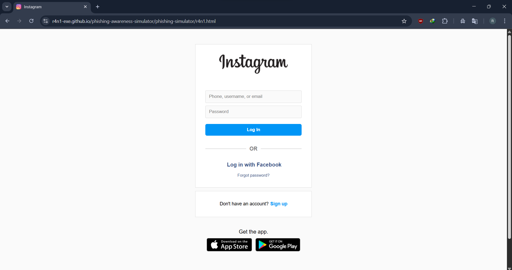
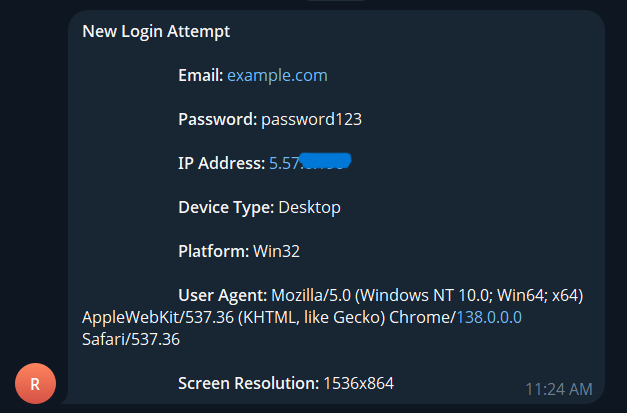

# 🎯 Phishing Awareness Simulator

This is a **simulated phishing landing page** created for **cybersecurity awareness and educational purposes**. The project demonstrates how phishing pages operate and how user input can be captured and sent to a monitoring system.

The page is hosted online using **GitHub Pages** and connected to a **Telegram bot** that receives submitted credentials and visitor metadata in real time.

## 🌐 Live Demo

🟢 Visit the live simulation here:  
[https://r4n1-exe.github.io/phishing-awareness-simulator/phishing-simulator/r4n1.html](https://r4n1-exe.github.io/phishing-awareness-simulator/phishing-simulator/r4n1.html)

> This is a demo and does not lead to any real service.

## 📸 Screenshots

### 🖥️ Landing Page   

### 📲 Telegram Bot Output  

## 📦 Features

- Fake login form (HTML/CSS)
- Hosted using GitHub Pages
- Sends captured data to a **Telegram bot**
- Collects the following:
  - Username & password
  - IP address
  - User-Agent string
  - Screen resolution

## 💬 Telegram Integration

Captured data is sent in real-time to a **Telegram bot** using the Telegram Bot API. The bot receives:

👤 Username: example@example.com

🔑 Password: hunter2

🌍 IP: 10.10.x.x

🧠 User-Agent: Mozilla/5.0 (...)

📱 Screen Res: 1366x768

## 📌 Author
Rani Kamaleddine

[GitHub Profile](https://github.com/r4n1-exe)

[LinkedIn](https://www.linkedin.com/in/rani-kamaleddine)
